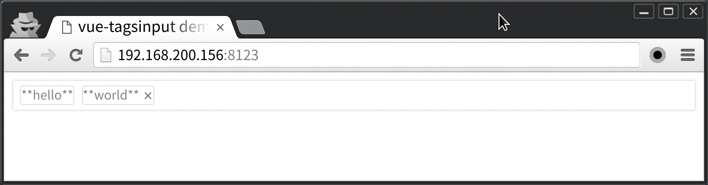

# vue-tagsinput
[![][npm-image]][npm-url]

[npm-image]: https://img.shields.io/npm/v/vue-tagsinput.svg
[npm-url]: https://npmjs.org/package/vue-tagsinput

>kerboard supported(left, right, backspace, tab).


## Requirement
- vue: `^2.1.0`

## Usage
```html
<div id="example">
    <tags-input
        :tags="tags"
        @tags-change="handleChange"
    ></tags-input>
</div>
```

## Example
[Live example](http://www.webpackbin.com/Vyc_H61fG)

## Props
- tags(array\<{ text: string, readOnly: ?boolean, invalid: ?boolean }>, required):
your tags to render
- placeholder(string): a hint to the user
- klass(object): override the class name (see below)

## Events
- tags-change: (index: number, text: ?string) => void
  `text` will be undefined if the tag was removed
- focus: (index: number) => void
- blur: (index: number) => void

## Class Names
```javascript
{
    container: 'tags-input',
    input: 'input',
    placeholder: 'placeholder',
    gap: 'gap',
    tag: 'tag'
}
```

## Migration from 0.x
Because of the two-way props was obsoleted in Vue@2, we should deal with tags by one-way props and onChange callback explicitly.
So most states will be handled in your scope. See the [full example](./example/full.vue).

## License

[MIT](LICENSE)
